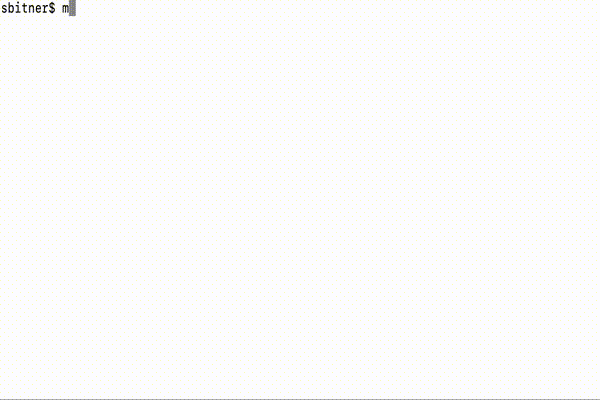

# COP 3530 - Data Structures and Algorithms I

# Project 4 - Boggle

## Objective:

This project is meant to help you familiarize yourself with backtracking algorithms and the usage of hashing data structures. You will be recreating the game of 'Boggle', which is a game that involves identifying as many words as possible from a 4 x 4 grid of letter dice. Each dice has 6 letters on it. This game will be single player with the player seeking to identify all words in the grid. 

## Learning Outcomes:

Developer a program that uses:

- Multiple modules
- Arrays
- Sets
- Backtracking

## Preparation:

To complete this project, you need to make sure that you have read the following (notice that topics between projects build upon each other):

- Chapter 3 - Strings
- Chapter 4 - Array and Vector Basics
- Chapter 5 - Function Basics
- Chapter 7 - Objects and Classes Basics
- Chapter 9 - Modular Design and Makefiles
- Chapter 10 - Memory Management
- The Arrays Handout on Canvas
- Chapter 12 - Recursion
- Chapter 16 - Hashing
- Chapter 18 - Heaps and Backtracking (Primarily the Recursive examples)

## Problem Description:

Boggle is a popular word game by Hasbro for any number of players. However, in our version, we will be playing a single person version of the game. Boggle is played with a tray of 16 6-sided, letter dice, which is shaken to get 16 random letters arranged in a 4 x 4 grid. You will be generating this grid for the player. 

Players must find as many words as they can in the grid. If you are familiar with the original game, please pay close attention to the following rules, we will be using a variant of the original game:

- The letters must be adjoining in a 'chain' with no wrapping. (Letter cubes in the chain may be adjacent horizontally or vertically, but not diagonally.)
- Words must contain at least three letters.
- Words can be formed by wrapping around the edge of a board to the other side. 
- No letter cube may be used more than once within a single word.
- Words within other words are permissable (e.g., part and art).
- You will not receive more points for submitting the same word multiple times.

An example of a Boggle board is as follows:

```
B E N H
L A U M
I T L Z
R G A N
```

In the above board, there are several examples of words, including 'eat', 'grit', and 'nag'. According to the rules of our game, 'zit' would also be an appropriate word as it wraps around the board from 'z'. However, words such as 'bat' and 'tan' which can be formed by going diagonal do not count. Proper names such as 'ben' do not count. 

In order to have interesting games of Boggle, distribution of letters on the dice is important. Therefore, you should make 16 dice with the following sides:

- Die 1 - R, I, F, O, B, X
- Die 2 - I, F, E, H, E, Y
- Die 3 - D, E, N, O, W, S
- Die 4 - H, M, S, R, A, O
- Die 5 - L, U, P, E, T, S
- Die 6 - A, C, I, T, O, A
- Die 7 - Y, L, G, K, U, E
- Die 8 - Q, B, M, J, O, A
- Die 9 - E, H, I, S, P, N
- Die 10 - V, E, T, I, G, N
- Die 11 - B, A, L, I, Y, T
- Die 12 - E, Z, A, V, N, D
- Die 13 - R, A, L, E, S, C
- Die 14 - U, W, I, L, R, G
- Die 15 - P, A, C, E, M, D
- Die 16 - U, T, O, K, N, D

Each die can fall into any of the 16 grid positions. In this version, players are given unlimited time to try to guess all words in the grid. The computer will keep track of all possible words and the maximum score that a player can earn. The player has the option to quit once they can no longer identify any words and compare their score to the maximum possible score. Scoring of the game works as follows (based on word length):

- Fewer than 3 Letters: no score
- 3 Letters: 1 point
- 4 Letters: 1 point
- 5 Letters: 2 points
- 6 Letters: 3 points
- 7 Letters: 4 points
- 8 or More Letters: 11 points

## Overview of the Interface:

When the program first loads, it will have randomized a board and found all possible words for the board. It will then show a player the board and prompt for a word: 

```
I S A A
L Y S I
Y A R O
A R F W
Enter a word (q to quit):
```

Note to keep things simple we will make all things case-sensitive (the words file is already in all uppercase). A player will then guess a word. If the word is incorrect, then the game will state that the guess was "Not worth any points": 

```
Enter a word (q to quit): SORRY
        Not worth any points
```

Otherwise, it will simply prompt for another word (and increase the player's score, though this is not necessary to show):

```
Enter a word: RAYS
Enter a word: FRAY
```
If the player decides to quit, they should be able to see the progress they made in the game and the maximum score they could have received:

```
Enter a word: q
You got 9 points and had 0 incorrect guesses.
There were 21 points possible
```

If the player has achieved the maximum points possible, then they should be notified that they can quit guessing:

```
Congratulations! You achieved 21 out of 21 possible points!
```

### Sample run of program


## Data Structures and Algorithms:

In the case of your program, words should be kept in an unordered set from the C++ STL. You can find more details on this in the additional requirements. 

## Code Organization:
You will need to make sure that your code meets the following specifications.
Note that there is some room for interpretation, but a general code outline is given below.
 
### The Main File
The main file shall handle setting up the initial game and prompting for guesses. 

### The Die Class


This class is responsible for handling a die (singular of dice) in the game. You need to pass it a string of 6 possible characters. Each character represents one possible side of the die. The roll method will randomly select one of the six characters and return the result.
 
### The GameBoard Class


This class is responsible for holding a game board of dice for Boggle. A Boggle board is a 4 x 4 grid of dice. In this case, you will only need to store the resulting characters from rolling the 16 dice. The constructor takes in a string composed of the 16 characters to be placed in the grid. This class should have the following additional methods:  

* `GetLetterByRowCol (int row, int col)`
	* Returns the character at the specified row and column.
* `ShowBoard ()`
	* Returns a string representation of the board (should include new lines as needed). 
 
### The Dictionary Class


This class is holds all possible words that could appear in any game. This class will read from words.txt to get all possible words, and then allow the program to check for whether a word exists. Note that we are using a set in this case for quick access (an array would be O(n) which in this case could be substantially longer). The constructor will loads the words, while IsWord will return whether or not a string is a word.   
 
 ### The WordFind Class


This class is responsible for finding all possible words that the player could guess from the board and storing them in a set. In addition to the constructor, this class should have the following methods:  

* `GetAllWords(GameBoard g)`
	* Responsible for setting up the arguments to call the recursive backtracking helper function that finds all possible words. Hint: you can call the recursive helper function 16 times, once for each starting location.  
* `AppendDFSWords(GameBoard g, std::string stringPrefix, std::set<std::string>& foundWords, bool alreadyChosen[16], int currentCell)`
	* This is the helper function that runs the recursive backtracking algorithm. It takes in a board g, the currently built word stringPrefix, the set of all words currently found on the board, an array denoting whether a character on the board has already been used, and the current position in the grid. Note, that positions are as a single integer which you can convert to a row and column in the grid based on row major form. Keep in mind that this function should find ALL possible words in the board, and not just a single word. 
        
### The Game Class


This class contains the primary logic of the Game. The constructor of this class will handle initializing the board if already rolled dice are not passed in, and will call the WordFind to get all possible words for the board. This class should have the following additional methods:  

* `initDice()`
	* Sets up the dice according to the distribution mentioned earlier in the description and places them into an array. Then shuffles the array (you can use the std::random_shuffle function).   
* `GetAllDiceValues ()`
	* Rolls each of the 16 dice and returns the results as a string of 16 characters.
* `IsValidGuess (std::string word)`
	* Checks whether the guess appears in the set of possible words for the board. 
* `NewWord (std::string word)`
	* Checks whether a word has been guessed before. 
* `GetWordScore (std::string word)`
	* Returns the number of points a word is worth in the game.   
* `GetPointsForSet (const std::set<std::string>& wordList)`
	* Returns the total number of points for a set of words. 
* `ShowBoard ()`
	* Returns the string representation of the board. 
* `Guess (std::string word)`
	* Checks whether the word is valid, if it is and hasn't been guessed before, should add to correct guesses and return true. If not, then should update number of incorrect guesses and return false.  
* `GetScore ()`
	* Returns the total number of points for all words that the player has guessed correctly. 
* `GetIncorrectGuesses()`
	* Returns the total number of incorrect guesses the player has made.
* `GetTotalPointsPossible()`
	* Returns the total number of points that the player could earn for the board. 
        
## Additional Requirements:

Your application must function as described below:

1. Your program must adhere to the class diagrams provided in this description.
2. You program must adhere to using the given interface as specified.
3. You must implement a backtracking algorithm to find all legal words. Your legal words will be stored in an unordered set. You can use the unordered set data structure from the standard template library in C++ (example, https://www.geeksforgeeks.org/unordered_set-in-cpp-stl/). You should not use any other data structure to store your words. 

## Important Notes:

- Projects will be graded on whether they correctly solve the problem, and whether they adhere to good programming practices.
- Projects must be received by the time specified on the due date. Projects received after that time will get a grade of zero.
- Do not change the test files unless told to! The results you get will be pointless as they will not align with our grading!
- Please review the academic honesty policy.
  - Note that viewing another student's solution, whether in whole or in part, is considered academic dishonesty.
  - Also note that submitting code obtained through the Internet or other sources, whether in whole or in part, is considered academic dishonesty. \* All programs submitted will be reviewed for evidence of academic dishonesty, and all violations will be handled accordingly.
  
## Breakdown of Grades:

You will find a rubric for the project in Canvas. 

## Submission Instructions:

1. All code must be added and committed to your local git repository.
2. All code must be pushed to the GitHub repository created when you "accepted" the assignment.
   1. After pushing, with `git push origin master`, visit the web URL of your repository to verify that your code is there.
      If you don't see the code there, then we can't see it either.
3. Your code must compile and run in Travis-CI or it might not be graded.
   1. The Travis-CI build should begin automatically when you push your code to GitHub.
   2. If your program will not compile, the graders will not be responsible for trying to test it.
   3. You should get an email regarding the status of your build, if it does not pass, keep trying.
